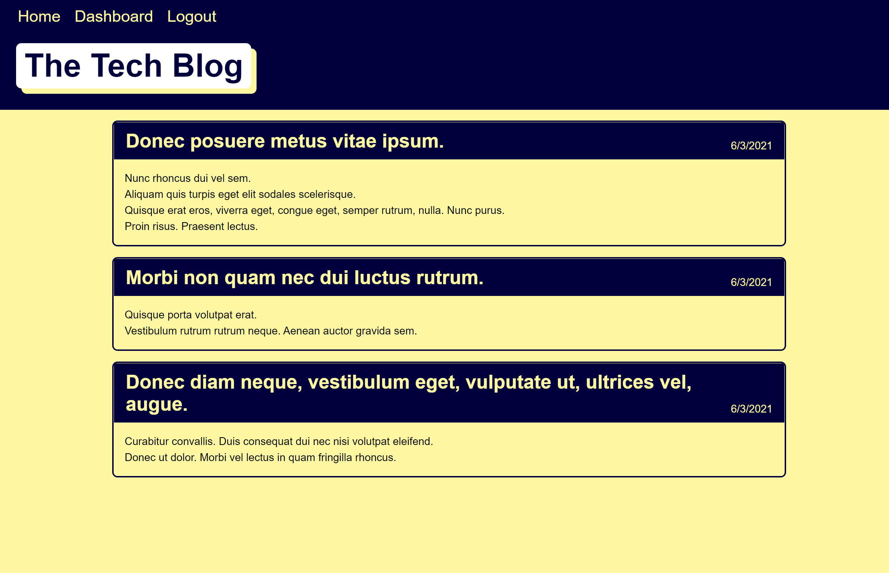
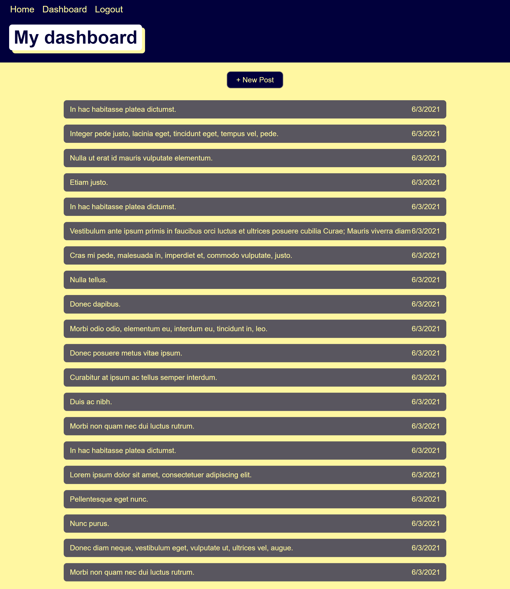
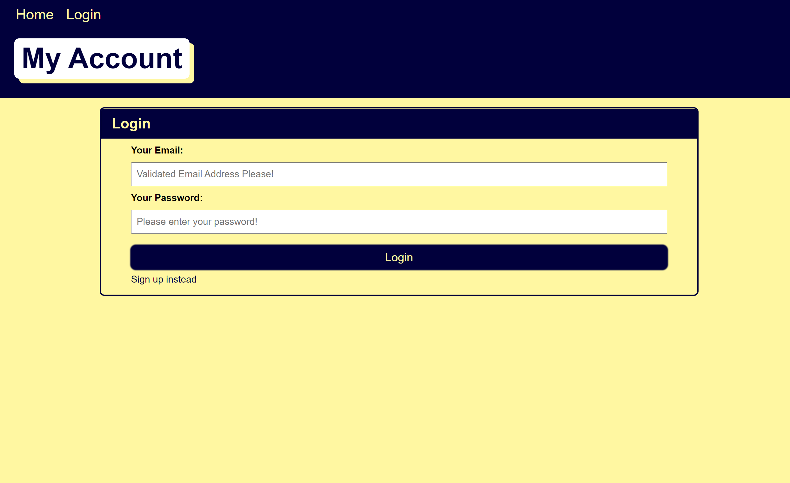
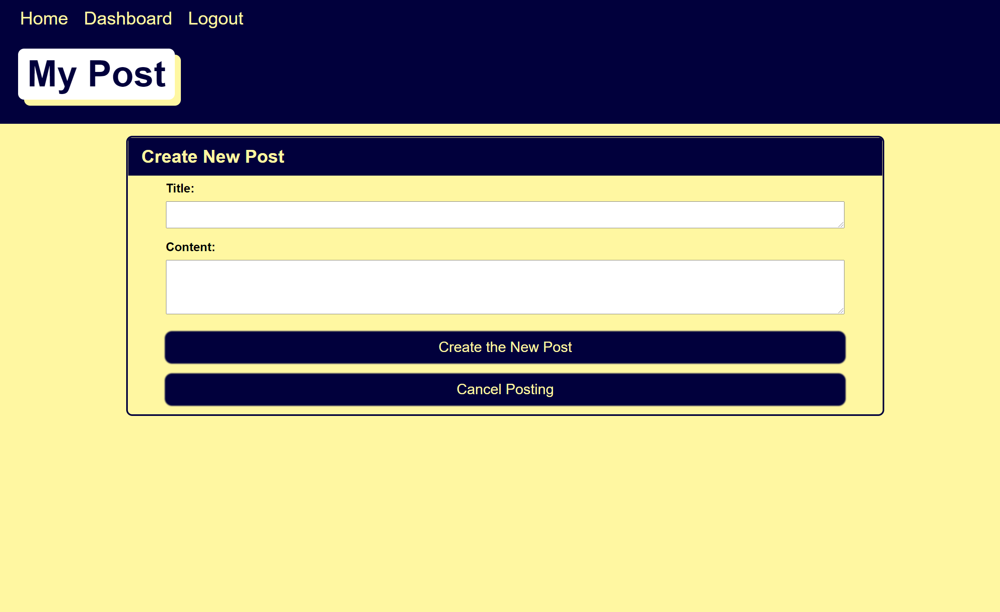
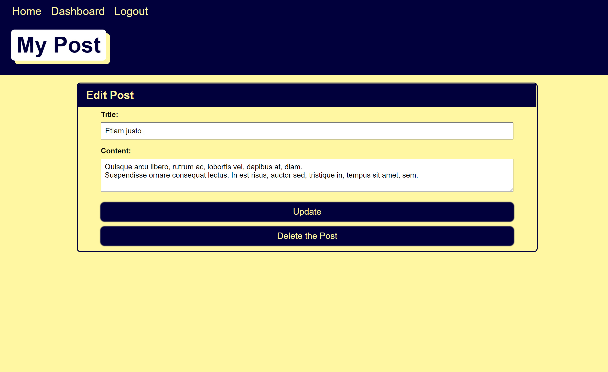

# **Rate My Ride**

> ## **_Description_**

Writing about tech can be just as important as making it. Developers spend plenty of time creating new applications and debugging existing codebases, but most developers also spend at least some of their time reading and writing about technical concepts, recent advancements, and new technologies. A simple Google search for any concept covered in this course returns thousands of think pieces and tutorials from developers of all skill levels!

To build a CMS-style blog site similar to a Wordpress site, where developers can publish their blog posts and comment on other developers’ posts as well. The app follows the MVC paradigm in its architectural structure, using Handlebars.js as the templating language, Sequelize as the ORM, and the express-session npm package for authentication.

---

### **_Table of Contents_**

- [Installation](#installation)
- [Usage](#usage)
- [Screen Shots](#Screen-shots)
- [Demo](#demo)
- [Features](#features)
- [Contribution](#contribution)
- [License](#license)

> ## **_Installation_**

```
npm start
```

> ## **_Usage_**

Here are some technologies used in the project.

This project took me 4 weeks to finish from week-14 until week-17. At the beginning of the project, I thought it would be an easy piece, but the whole process was far more harder and complicated than I thought.

Static html/css/js, models and seeds, controllers, MVC files. Everything seems easy, but when connecting them into a whole project, there were so many bugs and problems to deal with.

- Node
- Express
- Express-handlebars
- Express-handlebars
- bcrypt
- MySQL2
- Sequelize
- dotenv

> ## **_Screen-shots_**

**`Home:`**



**`Dashboard:`**



**`Login:`**



**`Sign-in:`**


**`New-Post:`**



**`Edit-Post:`**



> ## **_Demo_**

https://tech-blog-albert-jiang.herokuapp.com/

> ## **_Features_**

- UI update

  - Add a logo as favicon
  - Add comments system
  - Build dropdown list to show multiple comments

- Social Group
  - User can tag friends on posts and comments
  - User can create chatting groups with friends

> ## **_Contributing_**

Albert Jiang, John Blackwell

❤️

If you created an application or package and would like other developers to contribute it, you will want to add guidelines for how to do so. The [Contributor Covenant](https://www.contributor-covenant.org/) is an industry standard, but you can always write your own.

> ## **_License_**


Copyright (c) [year] [fullname]

https://choosealicense.com/licenses/mit/
